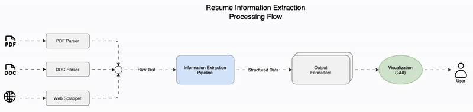
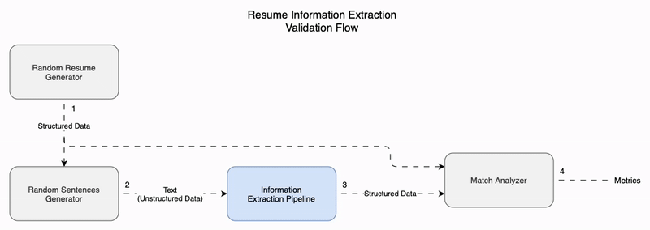

# Resume Information Extraction

**Resume Information Extraction** is a specialized pipeline designed for extracting structured data from resumes. This system ingests unstructured resume text and transforms it into a structured, machine-readable format, enabling automated processing and analysis of resume data.



## Basics

### Information Extraction

Information Extraction (IE) is a subfield of Natural Language Processing (NLP) that focuses on automatically extracting structured information from unstructured or semi-structured machine-readable documents. In simpler terms, IE transforms raw text into a structured format that a computer can easily understand and process. This structured format typically consists of entities, their attributes, and the relationships between them.

### Structured Data

When a resume is represented using a structured data format, each piece of information within the document has a clearly defined location. This structured approach allows machines to parse and understand the resume's organization and the relationships between different data elements. The structure is typically built using fundamental data types such as dictionaries, lists, and strings. Furthermore, this structure can be effectively serialized and represented using JSON (JavaScript Object Notation), a standard format for data interchange.

**Example**:

```json
{
  "personal_information": {
    "name": "Goku",
    "title": "Martial Artist / Protector of Earth",
    "contact": {
      "phone": "N/A",
      "email": "goku@kakunotsu.com",
      "address": "Planet Earth"
    },
    "birth_date": "1984",
    "birthplace": "Planet Vegeta",
    "languages": ["Earthling", "Saiyan"]
  },
  "objective": "To protect the Earth and its inhabitants, continuously strive for self-improvement, and overcome challenges through strength, determination, and teamwork.",
  "skills": [
    "Martial Arts Mastery",
    "Energy-Based Combat (Ki manipulation)",
    "Superhuman Strength",
    "Speed and Agility",
    "Flight (via Ki control)",
    "Tactical Combat & Battle Strategy",
    "Zenkai Boost (Rapid Recovery and Power Growth)",
    "Intergalactic Combat Experience"
  ],
  "work_experience": [
    {
      "title": "Protector of Earth",
      "company": "Earth Defense",
      "location": "Planet Earth",
      "dates": ["1990", "Present"],
      "responsibilities": [
        "Defend Earth from powerful threats such as Frieza, Cell, Majin Buu, and others.",
        "Work alongside Earth’s most powerful allies to ensure its safety.",
        "Lead in battle strategies and direct powerful attacks to defeat enemies.",
        "Train future generations of warriors, including Gohan, Trunks, and others."
      ]
    }
  ],
  "education": [
    {
      "degree": "Martial Arts Training",
      "school": "Master Roshi's Kame House",
      "location": "Kame House, Earth",
      "dates": ["1994", "1995"],
      "description": "Trained in martial arts and energy control under Master Roshi, specializing in hand-to-hand combat and ki energy techniques."
    }
  ],
  "certifications": [
    "Super Saiyan Transformation (Achieved)",
    "Super Saiyan Blue Transformation (Achieved)",
    "Ultra Instinct (Achieved)",
    "Kaio-Ken (Advanced Mastery)"
  ],
  "achievements": [
    "Defeated Frieza, Cell, Majin Buu, and numerous other foes.",
    "Achieved Super Saiyan and Super Saiyan Blue transformations.",
    "Secured Earth’s safety in the Tournament of Power and Universe 7's survival.",
    "Trained the next generation of warriors, including his son Gohan and others.",
    "Earned the respect of numerous beings across different universes."
  ],
  "references": [
    {
      "name": "Master Roshi",
      "title": "Martial Arts Master",
      "contact": "master@kamehouse.com"
    },
    {
      "name": "Vegeta",
      "title": "Prince of the Saiyans",
      "contact": "vegeta@planetvegeta.com"
    }
  ]
}
```

### Unstructured Data

Within the **Resume Information Extraction** pipeline, resumes are initially processed in an unstructured data format. In this format, the entire resume is treated as a single, unbroken string of text. Unlike structured data, there are no predefined fields or locations for specific pieces of information. The location of data elements, such as contact details or work experience, is highly variable and dependent on the individual resume's template and design.

**Example**:

```json
"Goku, Martial Artist / Protector of Earth, born in 1984 on Planet Vegeta, currently residing on Planet Earth. Contact: N/A phone, goku@kakunotsu.com email. Languages: Earthling, Saiyan. Objective: To protect the Earth and its inhabitants, continuously strive for self-improvement, and overcome challenges through strength, determination, and teamwork. Skills include Martial Arts Mastery, Energy-Based Combat (Ki manipulation), Superhuman Strength, Speed and Agility, Flight (via Ki control), Tactical Combat & Battle Strategy, Zenkai Boost (Rapid Recovery and Power Growth), and Intergalactic Combat Experience. Work Experience: Protector of Earth at Earth Defense (1990-Present), responsibilities include defending Earth from powerful threats such as Frieza, Cell, Majin Buu, and others; working alongside Earth’s most powerful allies to ensure its safety; leading in battle strategies and directing powerful attacks to defeat enemies; and training future generations of warriors, including Gohan, Trunks, and others. Education: Martial Arts Training at Master Roshi's Kame House (Kame House, Earth, 1994-1995), trained in martial arts and energy control under Master Roshi, specializing in hand-to-hand combat and ki energy techniques. Certifications: Super Saiyan Transformation (Achieved), Super Saiyan Blue Transformation (Achieved), Ultra Instinct (Achieved), Kaio-Ken (Advanced Mastery). Achievements: Defeated Frieza, Cell, Majin Buu, and numerous other foes; achieved Super Saiyan and Super Saiyan Blue transformations; secured Earth’s safety in the Tournament of Power and Universe 7's survival; trained the next generation of warriors, including his son Gohan and others; earned the respect of numerous beings across different universes. References: Master Roshi, Martial Arts Master, master@kamehouse.com; Vegeta, Prince of the Saiyans, vegeta@planetvegeta.com."
```

## Training

This section describes the training process of the **Resume Information Extraction** system, emphasizing the use of synthetic data to ensure data privacy and security.

### Data

The **Resume Information Extraction** system is trained using synthetically generated resume data. This approach ensures that no real personal information is utilized at any point in the process, guaranteeing data privacy and security. The use of synthetic data allows for the creation of a large and diverse training dataset without compromising the privacy of individuals. Furthermore, the synthetic data is designed to be highly diverse, representing a wide range of resume formats, styles, and content. This diversity helps to ensure that the system is robust and can handle various real-world resumes. The synthetic data generation process is carefully designed to avoid introducing any biases that could negatively impact the system's performance or fairness.

### Validation

The validation process ensures the accuracy and effectiveness of the **Resume Information Extraction** pipeline. This process involves several key components:

- **Random Resume Generator:** A tool that creates new resumes in a structured data format.
- **Random Sentences Generator:** A tool that transforms structured resumes into unstructured text.
- **Resume Information Extraction Pipeline:** The system being validated, which extracts structured data from unstructured text.
- **Match Analyzer:** A tool that compares structured data to evaluate the accuracy of the extraction pipeline.

The validation flow is illustrated in the diagram below.



The validation flow consists of the following steps:

1.  The Random Resume Generator creates a new resume in a structured data format. This structured format serves as the ground truth for validation.
2.  The Random Sentences Generator transforms the structured resume into unstructured text by embedding the resume's data elements within randomly generated sentences, simulating the variability found in real-world resumes.
3.  The Resume Information Extraction pipeline processes the unstructured text, extracting and structuring the embedded data. The output is a structured representation of the resume.
4.  The Match Analyzer compares the original, synthetically generated structured resume (ground truth) against the structured output produced by the Resume Information Extraction pipeline. This comparison yields performance metrics that quantify the pipeline's accuracy and effectiveness.

### Model Training

_Under development_
